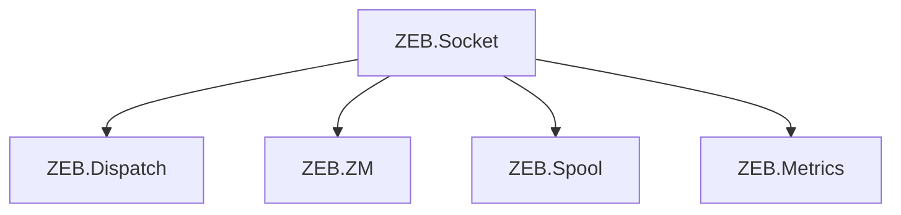

# ZeroMQ Ada Library

ZeroMQ仕様に基づいた純Adaライブラリの骨組みを提供します。ここではインターフェースのみを定義した空実装を含みます。

## 構成

```mermaid
graph TD
    ZSocket[ZEB.Socket]
    ZDispatch[ZEB.Dispatch]
    ZM[ZEB.ZM]
    ZSpool[ZEB.Spool]
    ZMetrics[ZEB.Metrics]
    ZSocket --> ZDispatch
    ZSocket --> ZM
    ZSocket --> ZSpool
    ZSocket --> ZMetrics
```

各モジュールは仕様書に記載された役割を担いますが、現在は空実装です。
