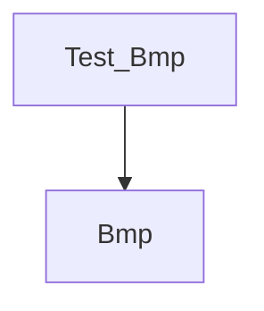

# bmp

256階調グレイスケールBMPファイルを読み書きするAdaプログラムの例です。

## 構成
以下の図はプログラムの構成を示しています。

- `Bmp` : BMPファイルを読み書きし、ピクセル配列を扱うパッケージ。
- `Test_Bmp` : リポジトリに含まれるサンプルBMPを読み込み、保存して再度読み込むテストプログラム。

## ビルドとテスト
```sh
 gprbuild -p -P bmp.gpr
 ./obj/test_bmp
```

## サンプル画像

このフォルダにはGit LFSで管理された `sample.bmp` が含まれます。
クローン直後は以下のコマンドでLFSを初期化してください。

```sh
git lfs install
git lfs pull
```
