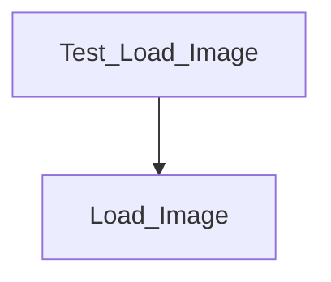

# load_image

256階調グレイスケールBMPファイルを読み込むAdaプログラムの例です。

## 構成
以下の図はプログラムの構成を示しています。

- `Load_Image` : BMPファイルを読み込み、ピクセル配列を返すパッケージ。
- `Test_Load_Image` : サンプルBMPファイルを読み込み、幅と高さを標準出力に表示するテストプログラム。

## ビルドとテスト
```sh
 gprbuild -p -P load_image.gpr
 ./obj/test_load_image
```
